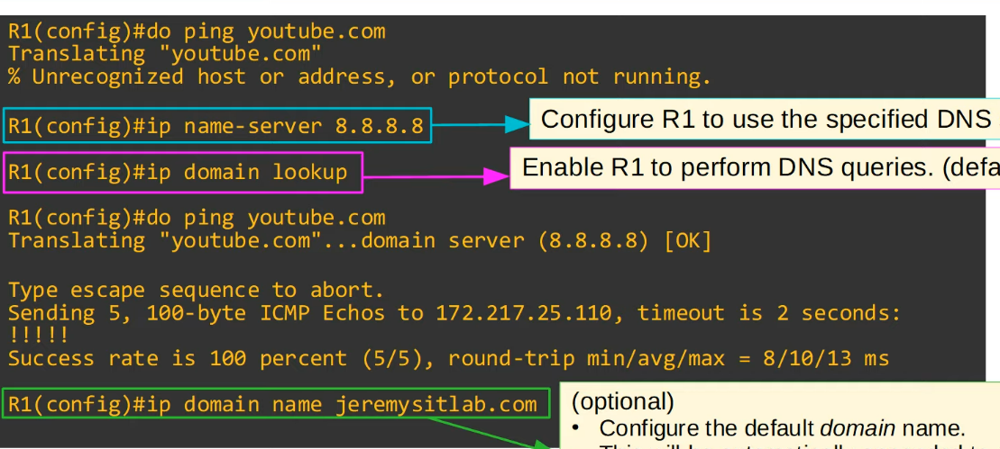

# RIP & EIGRP

## RIP (Routing Information Protocol)

* It is an industry standard protocol.
* Distance vector IGP (uses routing-by-rumor logic to learn/share routes).
* Uses hop count as its metric. One router = one hope (bandwidth is irrelevant).
* The maximum hop count is 15 (anything more than that is considered unreachable).
* Has three versions:
  * RIPv1 and RIPv2, used for IPv4.
  * RIPng (RIP Next Generation), used for IPv6.
* Uses two message types:
  * **Request:** To ask RIP-enabled routers to send their routing table.
  * **Response:** To send the local router's routing table to neighboring routers.
  * By default, RIP-enabled routers will share their routing table every 30 seconds.

<details>

<summary>RIPv1</summary>

* Only advertises classful addresses (Class A, Class B, Class C)
* Does not support VLSM, CIDR
* Does not include subnet mask information in advertisements (Response messages)
* Its messages are broadcast to 255.255.255.255

</details>

<details>

<summary>RIPv2</summary>

* Supports VLSM, CIDR
* Includes subnet mask information in advertisements
* Messages are **multicast** to 224.0.0.9 (Class D range)

</details>

## RIP Configuration

<figure><figcaption></figcaption></figure>

```
R1(config)#router rip
R1(config-router)#version 2
R1(config-router)#no auto-summary
R1(config-router)#network 10.0.0.0
R1(config-router)#network 172.16.0.0
```

* The RIP 'network' command is classful, so it will automatically convert to classful networks.
* For example, even if you enter the command _network 10.0.12.0_, it will be converted to _network 10.0.0.0_ (Class A network).
* There is no need to enter the network mask.
* The network command tells the router to:
  * Look for interfaces with an IP address that is in the specified range.
  * &#x20;Activate RIP on the interfaces that fall in the range.&#x20;
  * Form adjacencies with connected RIP neighbors.
  * Advertise the network prefix of the interface (NOT the prefix in the network command).&#x20;
* The OSPF and EIGRP network commands operate in the same way.
* The network command does not tell the router which networks to advertise. It tells the router which interfaces to activate RIP on, and then the router will advertise the network prefix of these interfaces.
* Although there are no RIP neighbors connected to G2/0, R1 will continuously send RIP advertisements out of G2/0. This is unnecessary traffic, so G2/0 should be configured as a **passive interface.**

```
R1(config-router)#passive-interface g2/0
```

* The **passive-interface** command tells the router to stop sending RIP advertisements out of the specified interface (G2/0).
* However, the router will continue to advertise the network prefix of the interface (172.16.1.0/28) to its RIP neighbors (R2, R3).
* EIGRP and OSPF both have the same passive interface functionality, using the same command.&#x20;

### Advertise a default route into RIP.

<figure><figcaption></figcaption></figure>

```
R1(configure-router)#default-information originate
```

```
R1#show ip protocols
*** IP Routing is NSF aware ***

Routing Protocol is "rip"
  Outgoing update filter list for all interfaces is not set
  Incoming update filter list for all interfaces is not set
  Sending updates every 30 seconds, next due in 28 seconds
  Invalid after 180 seconds, hold down 180, flushed after 240
  Redistributing: rip
  Default version control: send version 2, receive version 2
    Interface        Send  Recv  Triggered RIP  Key-chain
    GigabitEthernet0/0      2     2
    GigabitEthernet1/0      2     2
  Automatic network summarization is not in effect
  Maximum path: 4
  Routing for Networks:
    10.0.0.0
    172.16.0.0
  Passive Interface(s):
    GigabitEthernet2/0
  Routing Information Sources:
    Gateway         Distance      Last Update
    10.0.12.2       120          00:00:21
    10.0.13.2       120          00:00:06
  Distance: (default is 120)
```

```
R1(config-router)#maximum-paths <1-32>
R1(config-router)#distance <1-255>
```

## EIGRP (Enhanced Interior Gateway Routing Protocol)

* Was Cisco proprietary, but Cisco has now published it openly so other vendors can implement it on their equipment.
* Considered an 'advanced' / 'hybrid' distance vector routing protocol.
* &#x20;Much faster than RIP in reacting to changes in the network.
* &#x20;Does not have the 15 'hop-count' limit of RIP.
* Sends messages using multicast address 224.0.0.10
* Is the only IGP that can perfom unequa l-cost load-balancing (by default it performs ECMP load-balancing over 4 paths like RIP).

### EIGRP Configuration

```
R1(config)#router eigrp 1
R1(config-router)#no auto-summary
R1(config-router)#passive-interface g2/0
R1(config-router)#network 10.0.0.0
R1(config-router)#network 172.16.1.0 0.0.0.15
```

* The AS (Autonomous System) number must match between routers, or they will not form an adjacency and share route information.
* The network command will assume a classful address if you do not specify the mask.
* EIGRP uses a 'wildcard mask' instead of a regular subnet mask.
* In the routing table, EIGRP routes are indicated with the letter D, not E.

```
R1#show ip protocols
*** IP Routing is NSF aware ***

Routing Protocol is "eigrp 1"
  Outgoing update filter list for all interfaces is not set
  Incoming update filter list for all interfaces is not set
  Default networks flagged in outgoing updates
  Default networks accepted from incoming updates
  EIGRP-IPv4 Protocol for AS(1)
    Metric weight K1=1, K2=0, K3=1, K4=0, K5=0
    NSF-aware route hold timer is 240
    Router-ID: 172.16.1.14
    Topology : 0 (base)
      Active Timer: 3 min
      Distance: internal 90 external 170
      Maximum path: 4
      Maximum hopcount 100
      Maximum metric variance 1

Automatic Summarization: disabled
Maximum path: 4
Routing for Networks:
    10.0.0.0
    172.16.1.0/28
Passive Interface(s):
    GigabitEthernet2/0
Routing Information Sources:
    Gateway         Distance      Last Update
    10.0.12.2
```

Router ID order of priority:

1. Manual configuration
2. Highest IP address on a loopback interface
3. Highest IP address on a physical interface

```
R1(config-router)#eigrp router-id ?
  A.B.C.D  EIGRP Router-ID in IP address format

R1(config-router)#eigrp router-id 1.1.1.1
```

### Wildcard mask

* A wildcard mask is basically an 'inverted' subnet mask.
* All 1s in the subnet mask are 0 in the equivalent wildcard mask. All 0s in the subnet mask are 1 in the equivalent wildcard mask.
* A shortcut is to subtract each octet of the subnet mask from 255.
* '0' in the wildcard mask means that it must match.&#x20;
* '1' in the wildcard mask means that it does not have to match.

