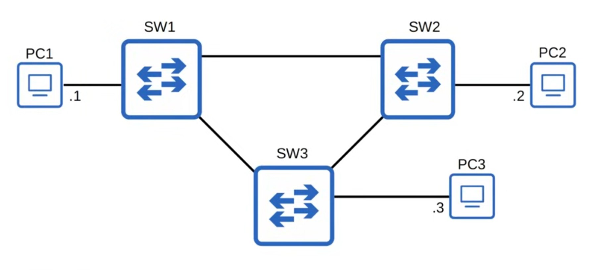

# Spanning Tree Protocol

## Network Redundancy

* Redundancy is an essential part of network design.
* Modern networks are expected to run 24/7/365. Even a short downtime can be disastrous for a business.
* If one network component fails, you must ensure that other components will take over with little or no downtime.
* As much as possible, you must implement redundancy at every possible point in the network.

## Broadcast storms

<figure><figcaption></figcaption></figure>

* If PC1 want to send some traffic to PC2, it needs to know PC2 MAC's address. so PC1 sends an ARP Request frame, which is a broadcast frame. The switches will flood it out all of its interfaces, except the one it was received on, therefore creating a loop.
* If enough of these looped broadcasts accumulate in the network, the network will be too congested for legitimate traffic to use the network. This is called a **broadcast storm.**
* Network congestion isn't the only problem. Each time a frame arrives on a switchport, the switch uses the source MAC address field to 'learn' the MAC address and update its MAC address table. When frames with the same source MAC address repeatedly arrive on different interfaces, the switch is continuously updating the interface in its MAC address table. This is known as **MAC Address Flapping**.

## STP

So, how can we design a network with redundant paths that doesn’t result in Layer 2 loops? Well, Spanning Tree Protocol is one answer to this problem.

* So let’s take a look at Spanning Tree protocol, what we now call ‘**classic spanning tree protocol**’ is an industry standard protocol, **IEEE 802.1D**.&#x20;
* Because it is so important to prevent Layer 2 loops, switches from ALL vendors run STP.
* STP prevents Layer 2 loops by placing redundant ports in a blocking state, essentially disabling the interface.
* These interfaces act as backups that can enter a forwarding state if an active (=currently forwarding interface fails).
* Interfaces in a forwarding state behave normally. They send and receive all normal traffic.
* However, interfaces in a blocking state only send or receive STP messages (called BPDUs = Bridge Protocol Data Units).

## Hubs, bridges and switches

Before the switch, there was a device called Bridge. It's like a transitional state between Hubs and Switches. Spanning Tree Protocol still uses the term ‘bridge’. However, when we use the term ‘bridge’, we really mean ‘switch’. Bridges are not used in modern networks.

* So, if we look at this topology again, perhaps these interfaces are in a forwarding state,
* While this one interface on SW3 is in a blocking state, effectively disabling the connection between SW2 and SW3. So effectively its like that link doesn’t exist, and this is our topology.

## Demonstration and algorithm

<figure><figcaption></figcaption></figure>

<figure><figcaption></figcaption></figure>

For example if the SW1-SW2 link fails, it will automatically adjust to it.

<figure><figcaption></figcaption></figure>

* By selecting which ports are forwarding and which ports are blocking, STP creates a single path to and from each point in the network. This prevents Layer 2 loops.
* There is a set process that STP uses to determine which ports should be forwarding and which should be blocking.
* STP-enabled switches send Hello BPDUs out of all interfaces, the default timer is 2 seconds, so the switch will send a Hello BPDU out of every interface, once every 2 seconds.
* If a switch receives a Hello BPDU on an interface, it knows that interface is connected to another switch, because routers, PCs, etc. do not use STP, so they do not send Hello BPDUs.

## BPDU

Switches use one field in the STP BPDU, the **Bridge ID** field, to elect a root bridge for the network. The switch with the **lowest Bridge ID** becomes the **root bridge**.

ALL ports on the **root bridge** are put in a forwarding state, and other switches in the topology must have a path to reach the root bridge.

Traditionally, the bridge ID field of the spanning tree BPDU looked like this:

<figure><figcaption></figcaption></figure>

The default bridge priority is 32768 on all switches, so by default the MAC address is used as the tie-breaker. The switch with the lowest bridge ID becomes the root bridge, so therefore by default the switch with the lowest MAC address becomes the root bridge.

The Bridge Priority is compared first. If they tie, the MAC address is then compared.

<figure><figcaption></figcaption></figure>

The G0/2 interface on each switch is connected to a PC, so because it isn’t receiving any BPDUs, it knows it is safe to go into forwarding mode, there is no risk of creating a Layer 2 loop.

Now, all three switches have the default priority of 32768, so in order to know which one will be the root bridge we will have to compare the MAC addresses. Remember, the LOWEST bridge ID wins. Which of these MAC addresses is the lowest? Well, hexadecimal A is equal to 10, B is equal to 11, and C is equal to 12, so SW1 has the lowest MAC address. Therefore, SW1 will become the root bridge of this network. All ports on the root bridge become designated ports, in a forwarding state. So, that is the traditional bridge ID.

<figure><figcaption></figcaption></figure>

## PVST (Extended System ID)

However, the bridge ID was actually updated to look like this. In reality, the bridge priority has been updated to be made of two parts, the bridge priority which is 4 bits, and the ‘extended system ID’, which is just the VLAN ID, which is 12 bits, because as you know a VLAN number is 12 bits in length.

Why include a VLAN ID in the bridge priority? Well, Cisco switches use a version of STP called **PVST**, which stands for Per-VLAN Spanning Tree. PVST runs a separate STP ‘instance’ in each VLAN, so in each VLAN different interfaces can be forwarding or blocking. One interface could be forwarding in VLAN1, but blocking in VLAN2, for example. By adding the VLAN ID into the bridge priority, the switch will have a different bridge ID in each VLAN.

<figure><figcaption></figcaption></figure>

* You may have wondered why 32768 is the default bridge priority. Well, it’s because this total field is 16 bits in length, and the most significant bit is set to 1 by default.&#x20;
* Therefore, the default bridge priority WAS 32768. However, with the addition of the extended-system ID, adding the VLAN ID number to the bridge priority, that changed.
* So, the default VLAN ID is 1, therefore the bridge priority in total actually ISN’T 32768, it’s 32769. In the default VLAN of 1, the default bridge priority is actually 32769, which is 32768 + 1.
* If you want to increase the switch’s bridge priority without changing VLAN numbers, what is the minimum unit of increase/decrease?

The **bridge priority + extended system ID** is a single field of the bridge ID, however the extended system ID is set and cannot be changed because it is determined by the VLAN ID. Therefore, you can only change the total bridge priority (that is, the bridge priority + extended system ID) in units of 4096, the value of the least significant bit of the bridge priority portion.

* The STP bridge priority can only be changed in units of 4096.
  * The valid values you can configure are:
    * 0, 4096, 8192, 12288, 16384, 20480, 24576, 28672, 32768, 36864, 40960, 45056, 49152, 52344, 61440.
  * The Extended System ID will then be added to this number to make the total bridge priority.

## Root Bridge

All ports on the root bridge are designated ports, so they are in a forwarding state. Designated port is one of the port roles in spanning tree.

* When a switch is powered on, it assumes it is the root bridge.
* It will only give up its position if it receives a ‘superior’ BPDU, and superior means a BPDU from a switch with a lower bridge ID.&#x20;
* Once the topology has converged and all switches agree on the root bridge, only the root bridge sends BPDUs.
* The reason all switches send BPDUs at first is because they all think they are the root bridge. Other switches in the network will forward BPDUs from the root bridge, but they will not generate their own original BPDUs.

## STP Port Role selection (Root Port selection via Root Cost)

1. The switch with the lowest bridge ID is elected as the root bridge. All ports on the root bridge are **designated ports**, so they are in a forwarding state.
2. Each remaining switch will select ONE of its interfaces to be its **root port.** The interface with the lowest root cost will be the root port. Root ports are also in a forwarding state.
   1. Each interface has an associated spanning tree ‘cost’.

| Speed    | STP Cost |
| -------- | -------- |
| 10 Mbps  | 100      |
| 100 Mbps | 19       |
| 1 Gbps   | 4        |
| 10 Gbps  | 2        |

The root cost is the total cost of the outgoing interfaces along the path to the root bridge. SW1 is the root bridge, so it has a cost of 0 on all interfaces.

So, SW1 advertises its root cost of 0 in its BPDUs. SW2 will receive the BPDU and add the cost of its outgoing interface, G0/1, which is 4, when it floods those BPDUs out of its interfaces. SW3 will do the same. So, which port do you think SW2 will choose as its root port?

It was advertised a cost of 4 on G0/0, from SW3. However its interface also has a cost of 4, so the total root cost via G0/0 is 8. So, it will select G0/1 as the root port.

* The ports connected to another switch's root port MUST be designated. Because the root port is the switch's path to the root bridge, another switch must not block it.


1. One switch is elected as the root bridge. All ports on the root bridge are **designated ports (forwarding state)**. Root bridge election:
   1. There is only one step in selecting the root bridge, that is the switch with the lowest bridge ID.
2. Each remaining switch will select ONE of its interfaces to be its **root port**, which is also in a **forwarding state**. Ports across from, ports connected to, the root port are always **designated** **ports**.
   1. The first criteria for root port selection is the port with the lowest root cost. However, what if a switch has multiple ports with the same root cost? In that case, the interface connected to the neighbor with the lowest bridge ID will be selected as the root port.
   2.  HOWEVER, there is ONE more tiebreaker that might be needed to select the root port.

       What if two switches have two connections between them, so both the root cost and the neighbor bridge ID are the same? Then we get to the final tie-breaker, the interface connected to the interface on the neighbor switch with the lowest port ID will become the root port.

       1. STP Port ID = port priority (default 128) + port number
       2. The NEIGHBOR switch's port ID is used to break the TIE, not the local switch's port ID.
3. Each remaining collision domain will select ONE interface to be a designated port (forwarding state). The other port in the collision domain will be non-designated (blocking)
   1. Designated port selection:
      1. Interface on switch with lowest root cost.
      2. Interface on switch with lowest bridge ID.
   2. Then the other interface will be a non-designated port, in a blocking state.

## Spanning Tree Port States

| STP Port State | Stable/Transitional |
| -------------- | ------------------- |
| **Blocking**   | Stable              |
| **Listening**  | Transitional        |
| **Learning**   | Transitional        |
| **Forwarding** | Stable              |

* &#x20;Root/Designated ports remain stable in a **Forwarding** state.
* Non-designated ports remain stable in a **Blocking** state.
* **Listening** and **Learning** are transitional states which are passed through when an interface is activated, or when a Blocking port must transition to a Forwarding state due to a change in the network topology.

Actually, there is one more state you might hear of, this is the **disabled** state. This simply refers to an interface that is administratively disabled, meaning shutdown.

### Blocking state

* Non-designated ports are in a Blocking state.
* Interfaces in a Blocking state are effectively disabled to prevent loops.
* Interfaces in a Blocking state do not send/receive regular network traffic. Any regular traffic that arrives on an interface in a blocking state will simply be dropped.
* However, Interfaces in a Blocking state do receive STP **BPDUs**.
  * Interfaces in a Blocking state do NOT forward STP BPDUs.
  * Interfaces in a Blocking state do NOT learn MAC addresses.

### Listening state

* After the Blocking state, interfaces with the Designated or Root role enter the Listening state.
* Only Designated or Root ports enter the Listening state, Non-designated ports are always Blocking.
* The Listening state is 15 seconds long by default. This is determined by a timer called the ‘Forward delay’ timer.
* An interface in the Listening state ONLY forwards/receives Spanning Tree BPDUs. It does NOT send or receive regular traffic. If a regular unicast frame is received on a port in the Listening state, it will be discarded.&#x20;
* An interface in the Listening state also does NOT learn MAC addresses from regular traffic that arrives on the interface.

### Learning state

* After the Listening state, a Designated or Root port will enter the Learning state.&#x20;
* The Learning state is 15 seconds long by default. This is determined by the Forward delay timer, so the same timer is used for both the Listening and Learning states, meaning by default it takes a total of 30 seconds to move through both states and enter a forwarding state.
* Same as in the Listening state, an interface in the Learning state ONLY sends or receives spanning tree protocol BPDUs. Also, it does NOT send or receive regular traffic.
* However, here is the difference between the Listening and Learning states. An interface in the Learning state _**learns**_ MAC addresses from regular traffic that arrives on the interface. So, an interface in the learning state is preparing to forward traffic by building up some of its MAC address table beforehand.

### Forwarding state

* Root and Designated ports are in a Forwarding state when they're stable.&#x20;
* A port in the Forwarding state operate as normal.
* A port in the Forwarding state sends and receives BPDUs.&#x20;
* It sends and receives normal traffic.&#x20;
* Also it learns MAC addresses from the frames that arrive on it, and adds them to the MAC address table.&#x20;
* So, it’s a switchport operating as normal.

| STP Port State | Send/Receive BPDUs | Frame forwarding (regular traffic) | MAC address learning | Stable/Transitional |
| -------------- | ------------------ | ---------------------------------- | -------------------- | ------------------- |
| **Blocking**   | NO/YES             | NO                                 | NO                   | Stable              |
| **Listening**  | YES/YES            | NO                                 | NO                   | Transitional        |
| **Learning**   | YES/YES            | NO                                 | YES                  | Transitional        |
| **Forwarding** | YES/YES            | YES                                | YES                  | Stable              |
| **Disabled**   | NO/NO              | NO                                 | NO                   | Stable              |

## Spanning Tree Timers

| STP Timer         | Purpose                                                                                                          | Duration            |
| ----------------- | ---------------------------------------------------------------------------------------------------------------- | ------------------- |
| **Hello**         | How often the root bridge sends hello BPDUs                                                                      | **2sec**            |
| **Forward delay** | How long the switch will stay in the Listening and Learning states (each state is 15 seconds = total 30 seconds) | **15sec**           |
| **Max Age**       | How long an interface will wait **after ceasing to receive Hello BDPUs** to change the STP topology.             | _20sec (10\*hello)_ |

Note that switches do not forward the BPDUs out of their root ports and non-designated ports, only their designated ports.

* If another BPDU is received before the max age timer counts down to 0, the time will reset to 20 seconds and no changes will occur.
* However, If another BPDU is not received, the max age timer counts down to 0 and the switch will reevaluate its STP choices, including root bridge, and local root, designated, and non-designated ports.
* After these decisions, if a non-designated port is selected to become a designated or root port, it will transition from the blocking state to the listening state (for 15 seconds), learning state (again for 15 seconds), and then finally the forwarding state.
* So, it can take a total of 50 seconds for a blocking interface to transition to forwarding.
* Why does it take so long? Well, these timers and transitional states are to make sure that loops aren’t accidentally created by an interface moving to forwarding state too soon.
* However, a forwarding interface can move directly to a blocking state, because there is no worry about creating a loop by blocking an interface.
* A blocking interface cannot move directly to forwarding state. It must go through the listening and learning states.

Cisco’s PVST+ uses the destination MAC address of 0100.0ccc.cccd for its BPDUs.

Well, PVST is an older version which only supports Cisco’s ISL for trunk encapsulation. PVST+ is a newer version which supports dot1q.

Regular spanning tree, meaning not Cisco’s PVST or PVST+, uses a destination MAC address of 0180.c200.0000.

## STP Toolkit&#x20;

* Spanning Tree Optional Features (STP Toolkit)
  * Options that improve the functionalitites of the STP.

### Portfast

* Can be enabled on interfaces which are connected to the endhosts.
* There is no fear of creating broadcast storms between the links of a switch and an endhost. However, the switch will take about 30 seconds to be in the forwarding state. So wouldn't it be nice if these ports connected to endhosts could start forwarding away, without having to wait 30 seconds to go from listening to learning to forwarding? That is what portfast does.
* Portfast allows a port to move immediately to the Forwarding state, bypassing Listening and Learning.&#x20;
* If used, it must be enabled on _ports connected to end hosts_.
* If enabled on a port connected to another switch, it could cause a Layer 2 loop.

```
SW1(config)#interface g0/2
SW1(config-if)#spanning-tree portfast
%Warning: portfast should only be enabled on ports connected to a single host. Connecting hubs, concentrators, switches, bridges, etc... to this interface when portfast is enabled, can cause temporary bridging loops. Use with CAUTION

%Portfast has been configured on GigabitEthernet0/2 but will only have effect when the interface is in a non-trunking mode.
SW1(config-if)#
```

* You can also enable portfast with the following command:

```
SW1(config)# spanning-tree portfast default
```


This enables portfast on all **access ports** (not trunk ports).


However, it can still be a risk. The portfast configuration can create a loop if there are any cabling changes in the network.

### BPDU Guard

* If an interface with BPDU Guard enabled receives a BPDU from another switch, the interface will be shut down to prevent a loop from forming.

```
SW1(config)#interface g0/2
SW1(config-if)#spanning-tree bpduguard enable
SW1(config-if)
```

* You can also enable BPDU Guard with the following command:

```
SW1(config)# spanning-tree portfast bpduguard default
```

* This enables BPDU Guard on all Portfast-enabled interfaces.

| Feature    | Description                                                                                                                                                                                                      |
| ---------- | ---------------------------------------------------------------------------------------------------------------------------------------------------------------------------------------------------------------- |
| Root Guard | If you enable root guard on an interface, even if it receives a superior BPDU (lower bridge ID) on that interface, the switch will not accept the new switch as the root bridge. The interface will be disabled. |
| Loop Guard | If you enable loop guard on an interface, even if the interface stops receiving BPDUs, it will not start forwarding. The interface will be disabled.                                                             |

## STP configuration

```
SW1(config)#spanning-tree mode ?
mst          Multiple spanning tree mode
pvst         Per-Vlan spanning tree mode
rapid-pvst   Per-Vlan rapid spanning tree mode

SW1(config)#spanning-tree mode pvst
```

### Configure the Primary Root Bridge

```
SW3(config)#spanning-tree vlan 1 root primary
SW3(config)#do show spanning-tree

VLAN0001
  Spanning tree enabled protocol ieee
  Root ID    Priority    24577
             Address     cccc.cccc.cccc
             This bridge is the root
             Hello Time  2 sec  Max Age 20 sec  Forward Delay 15 sec

  Bridge ID  Priority    24577 (priority 24576 sys-id-ext 1)
             Address     cccc.cccc.cccc
             Hello Time  2 sec  Max Age 20 sec  Forward Delay 15 sec
             Aging Time  15  sec
```

The spanning-tree vlan vlan-number root primary command sets the STP priority to 24576. If another switch already has a priority than 24576, it sets this switch priority to 4096 less than the other switch's priority.

### Configure the Secondary Root Bridge

```
SW2(config)#spanning-tree vlan 1 root secondary
SW2(config)#do show spanning-tree

VLAN0001
  Spanning tree enabled protocol ieee
  Root ID    Priority    24577
             Address     cccc.cccc.cccc
             Cost        4
             Port        1 (GigabitEthernet0/0)
             Hello Time  2 sec  Max Age 20 sec  Forward Delay 15 sec

  Bridge ID  Priority    28673 (priority 28672 sys-id-ext 1)
             Address     bbbb.bbbb.bbbb
             Hello Time  2 sec  Max Age 20 sec  Forward Delay 15 sec
             Aging Time  300 sec
```

### STP Load-Balancing

If you have multiple VLANs in your network, blocking the same interface in each VLAN is a waste of interface bandwidth. That connection will be doing nothing, just waiting for another connection to fail so it can start forwarding. However, if you configure a different root bridge for different VLANs, different VLANs will disable different interfaces.

### Configure STP Port Settings

```
SW2(config-if)#spanning-tree vlan 1 ?
cost          Change an interface's per VLAN spanning tree path cost
port-priority Change an interface's spanning tree port priority
SW2(config-if)#spanning-tree vlan 1
```
